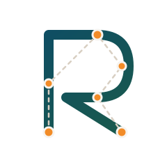

# Ri7la: Composable VRP Library

<p align="center">
  
</p>

[](https://app.codacy.com/manual/me_183/routing?utm_source=github.com&utm_medium=referral&utm_content=sohaibafifi/routing&utm_campaign=Badge_Grade_Dashboard)

**Ri7la** is a modern, modular C++ library for solving Vehicle Routing Problems (VRP). It features a **Composable Architecture** that separates problem definition (Attributes) from solution methods (Solvers), allowing you to mix and match components to solve complex variants efficiently.

## Project Ecosystem

### 1. Composable Problem Definition (Attributes)
Define your problem by composing standard attributes. The library handles the complex interactions between them.

*   **Capacity**: Demand and vehicle capacity handling (`plugins/attributes/CapacityPlugin`).
*   **Time Windows**: Service times, arrival windows, and waiting times (`plugins/attributes/TimeWindowPlugin`).
*   **Pickup & Delivery**: Linked pickup and delivery requests (`plugins/attributes/PickupDeliveryPlugin`).
*   **Profit**: For variants like Team Orienteering or Prize Collecting VRP (`plugins/attributes/ProfitPlugin`).
*   **Synchronization**: Constraints between vehicles or nodes (`plugins/attributes/SyncPlugin`).

### 2. Multi-Paradigm Solvers
The library expects to support a wide range of exact and heuristic solvers:

**Exact Methods:**
*   **CP Optimizer**: Wrapper for IBM ILOG CP Optimizer (Constraint Programming).
*   **XCSP3**: Generates standard XCSP3 models for solvers like **ACE**, **CoSoCo**, or **Choco**.
*   **MIP**: Mathematical Programming backend (supports **Gurobi** and **CPLEX**).

**Metaheuristics & Heuristics:**
*   **Local Search (LS)**: Core local search framework (`plugins/solvers/LSSolverPlugin`).
*   **Genetic Algorithm (GA)**: Population-based evolution (`plugins/solvers/GASolverPlugin`).
*   **Memetic Algorithm (MA)**: Hybrid GA + Local Search (`plugins/solvers/MASolverPlugin`).
*   **Particle Swarm Optimization (PSO)**: Swarm intelligence (`plugins/solvers/PSOSolverPlugin`).
*   **Variable Neighborhood Search (VNS)**: Systematic neighborhood exploration (`plugins/solvers/VNSSolverPlugin`).

### 3. Neighborhoods & Operators
For heuristic solvers, efficient move operators are available:
*   **2-Opt**: Classic route improvement operator (`plugins/neighborhoods/TwoOptPlugin`).
*   **IDCH**: Iterated Destroy and Construct Heuristic (`plugins/neighborhoods/IDCHPlugin`).

## Python Extension

*   [**Python Extension**](python/pycsp3_extension/README.md): Documentation for the new **Python Composable API**, which allows modeling VRPs in Python and solving them via the XCSP3 ecosystem (PyCSP3).

## Compilation

```bash
git submodule update --init --recursive
cmake -S . -B build -DCMAKE_BUILD_TYPE=Release
cmake --build build
```

### CMake Options

| Option | Default | Description |
| :--- | :--- | :--- |
| `ROUTING_BUILD_EXAMPLES` | `ON` | Build example executables. |
| `ROUTING_BUILD_XCSP3` | `ON` | Build the XCSP3 solver backend. |
| `ROUTING_BUILD_CPOPTIMIZER` | `ON` | Build CP Optimizer support (requires CPLEX). |
| `ROUTING_BUILD_GRB` | `ON` | Build Gurobi support (requires Gurobi). |
| `BUILD_TESTING` | `ON` | Build unit tests. |

## External References

This project leverages and integrates with top-tier optimization tools:

*   **[XCSP3](http://www.xcsp.org/)**: The standard XML format for CP models.
*   **[ACE](https://github.com/xcsp3team/ace)**: A state-of-the-art open-source CP solver.
*   **[PyCSP3](https://pycsp.org/)**: Python modeling library for combinatorial problems.
*   **[CP Optimizer](https://www.ibm.com/products/ilog-cplex-optimization-studio/cplex-cp-optimizer)**: IBM's constraint programming solver.
*   **[Gurobi](https://www.gurobi.com/)**: Another mathematical programming solver.

## License
You are allowed to retrieve this project for research purposes as a member of a non-commercial and academic institution.
