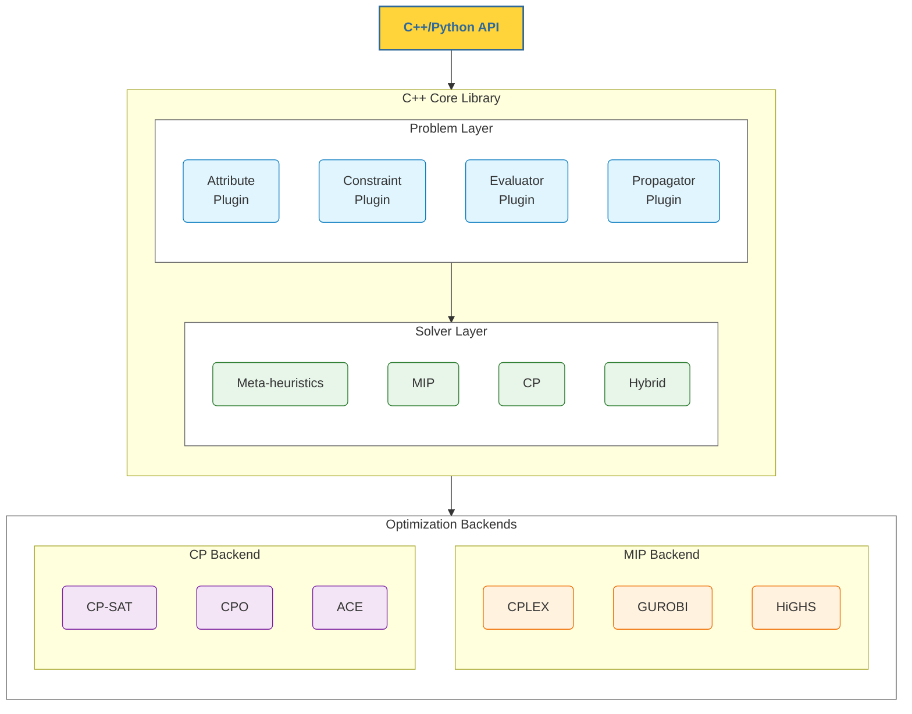

# Ri7la: Composable VRP Library

```{image} assets/logo.svg
:alt: Routing Logo
:width: 120px
:align: center
```

<div class="hero-tagline" style="text-align: center; margin: 1.5rem 0 2.5rem 0;">
<strong style="font-size: 1.25rem;">A modern C++20 library for Vehicle Routing Problems</strong><br/>
<span style="color: #666;">Combining metaheuristics, constraint programming, and mixed-integer programming with a composable attribute system.</span>
</div>

::::{grid} 1 2 2 3
:gutter: 3

:::{grid-item-card} Composable Attributes
:class-card: feature-card
:link: composable
:link-type: doc

Runtime composition of problem features. No deep inheritance hierarchies needed.
:::

:::{grid-item-card} Multiple Solvers
:class-card: feature-card
:link: solvers
:link-type: doc

GA, MA, VNS, PSO, ALNS, LS, MIP (CPLEX/HiGHS/GUROBI), CP (CPO/OR-Tools/ACE) - all unified under one API.
:::

:::{grid-item-card} Python & C++
:class-card: feature-card
:link: getting-started
:link-type: doc

Full Python bindings with pip install. Native C++20 performance when you need it.
:::

:::{grid-item-card} XCSP3 Export
:class-card: feature-card
:link: https://www.xcsp.org/
:link-type: url

Export problems to [XCSP3](https://www.xcsp.org/) format for interoperability with any CP solver.
:::

:::{grid-item-card} Plugin Architecture
:class-card: feature-card
:link: plugins
:link-type: doc

Extensible design with plugins for attributes, constraints, solvers, and evaluators.
:::
::::

---

## Architecture Overview



---

## Quick Start

::::{tab-set}

:::{tab-item} Python
:sync: python

```python
import routing
from routing.constants import Attribute

# Initialize the library
routing.init()

# Load a Solomon CVRPTW instance
problem = routing.load_solomon("data/CVRPTW/Solomon/10/c101.txt")

# Solve with genetic algorithm
solution = routing.solve(problem, "ga", timeout=30)

if solution:
    print(f"Best cost: {solution.cost:.2f}")
```
:::

:::{tab-item} C++
:sync: cpp

```cpp
#include <routing/routing.hpp>

int main() {
    routing::Problem problem;

    // Enable CVRPTW attributes
    problem.enableAttributes<
        routing::attributes::GeoNode,
        routing::attributes::Consumer,
        routing::attributes::Stock,
        routing::attributes::Rendezvous,
        routing::attributes::ServiceQuery>();

    // Add depot at origin
    auto* depot = problem.addDepot(0);
    depot->addAttribute<routing::attributes::GeoNode>(0.0, 0.0);
    depot->addAttribute<routing::attributes::Rendezvous>(0.0, 1000.0);

    // Add a client
    auto* client = problem.addClient(1);
    client->addAttribute<routing::attributes::GeoNode>(10.0, 20.0);
    client->addAttribute<routing::attributes::Consumer>(15);
    client->addAttribute<routing::attributes::Rendezvous>(0.0, 200.0);
    client->addAttribute<routing::attributes::ServiceQuery>(5.0);

    // Add vehicle
    auto* vehicle = problem.addVehicle(0);
    vehicle->addAttribute<routing::attributes::Stock>(100);

    // Solve with MIP
    routing::MIPSolver solver(&problem, "highs");
    if (solver.solve(60.0)) {
        std::cout << "Optimal: " << solver.getObjectiveValue() << std::endl;
    }
}
```
:::

::::

---

## Supported Problem Types

| Problem | Attributes | Description |
|---------|-----------|-------------|
| **TSP** | `GeoNode` | Traveling Salesman Problem |
| **VRP** | `GeoNode` | Vehicle Routing Problem |
| **CVRP** | `GeoNode`, `Consumer`, `Stock` | Capacitated VRP |
| **VRPTW** | `GeoNode`, `Rendezvous`, `ServiceQuery` | VRP with Time Windows |
| **CVRPTW** | `GeoNode`, `Consumer`, `Stock`, `Rendezvous`, `ServiceQuery` | Capacitated VRPTW |
| **TOP** | `GeoNode`, `Profiter` | Team Orienteering Problem |
| **PDVRP** | `GeoNode`, `Pickup`, `Delivery` | Pickup & Delivery VRP |
| **VRPTWTD** | All above + `Synced` | VRPTW with Temporal Dependencies |

---

## Available Solvers

::::{grid} 2 2 3 3
:gutter: 2

:::{grid-item}
**Metaheuristics**
- Genetic Algorithm (GA)
- Memetic Algorithm (MA)
- Variable Neighborhood Search (VNS)
- Particle Swarm (PSO)
- Adaptive Large Neighborhood Search (ALNS)
- Local Search (LS)
:::

:::{grid-item}
**Exact Methods (MIP)**
- CPLEX MIP
- HiGHS MIP (open-source)
:::

:::{grid-item}
**Constraint Programming**
- CPLEX CP Optimizer
- OR-Tools CP-SAT
- [XCSP3](https://www.xcsp.org/) export
:::
::::

---

## Plugin System

The library uses a modular plugin architecture for maximum extensibility:

::::{grid} 2 2 4 4
:gutter: 2

:::{grid-item-card} Attributes
:class-card: sd-text-center

`GeoNode`, `Consumer`, `Stock`, `Rendezvous`...

Define problem features
:::

:::{grid-item-card} Constraints
:class-card: sd-text-center

`RoutingGenerator`, `CapacityGenerator`, `TimeWindowGenerator`...

Generate solver constraints
:::

:::{grid-item-card} Solvers
:class-card: sd-text-center

`GASolver`, `MIPSolver`, `CPSolver`...

Optimization engines
:::

:::{grid-item-card} Evaluators
:class-card: sd-text-center

`DistanceEvaluator`, `CapacityEvaluator`...

Solution quality metrics
:::
::::

Plugins are auto-registered at startup. Add your own by implementing the interface and using the `ROUTING_REGISTER_*` macros:

```cpp
// Custom constraint generator - automatically registered
class MyConstraintGenerator : public IConstraintGenerator {
    std::string name() const override { return "MyConstraint"; }
    void addConstraints(IBackend& backend) override { /* ... */ }
};
ROUTING_REGISTER_GENERATOR(MyConstraintGenerator)
```

See [Plugins](plugins.md) for the full guide.

---

## Installation

::::{tab-set}

:::{tab-item} Python (pip)
:sync: python

```bash
# From the repository
cd python
pip install -e .

# Quick test
python -c "import routing; routing.init(); print(routing.list_solvers())"
```
:::

:::{tab-item} C++ (CMake)
:sync: cpp

```bash
# Clone and build
git clone https://github.com/sohaibafifi/rihla.git
cd routing
git submodule update --init --recursive

# Configure and build
cmake -S . -B build -DCMAKE_BUILD_TYPE=Release
cmake --build build --parallel

# Run tests
ctest --test-dir build --output-on-failure
```
:::

::::

---

## Documentation

```{toctree}
:maxdepth: 2
:caption: Getting Started

getting-started
installation
concepts
```

```{toctree}
:maxdepth: 2
:caption: User Guide

solvers
attributes
benchmarks
```

```{toctree}
:maxdepth: 2
:caption: API Reference

api
```

```{toctree}
:maxdepth: 2
:caption: Developer Guide

composable
plugins
contributing
```

---

## Citing

If you use this library in research, please cite:

```bibtex
@software{routing2026,
  author = {AFIFI, Sohaib},
  title = {Rihla: A Composable Vehicle Routing Problem Library},
  year = {2026},
  url = {https://github.com/sohaibafifi/rihla}
}
```

See `paper/` for the manuscript and benchmarks.

---

<div style="text-align: center; margin-top: 2rem; color: #888; font-size: 0.9rem;">

**License**: Academic/Research Use | **Language**: C++20 | **Python**: 3.9+

</div>
